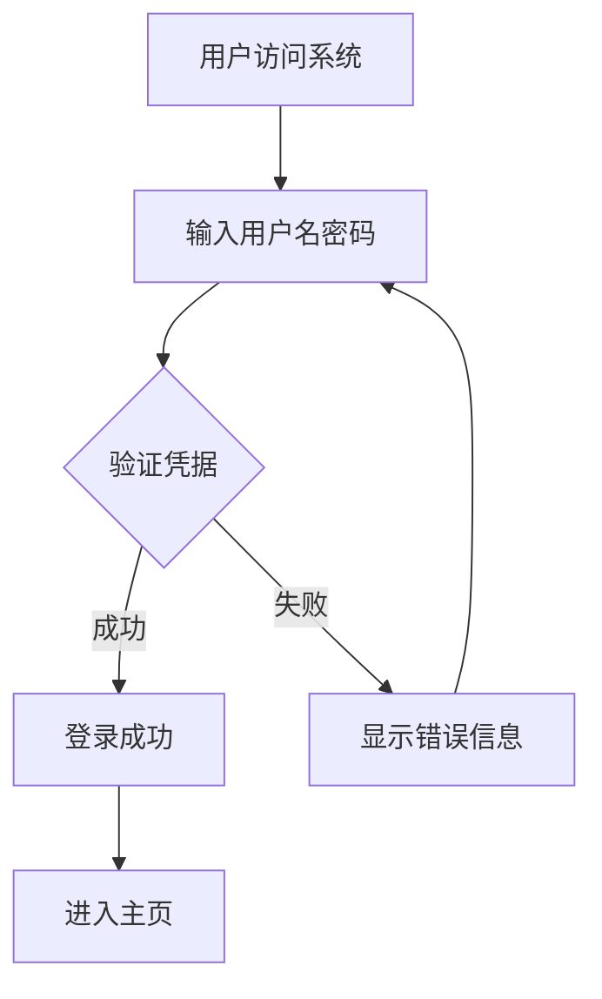
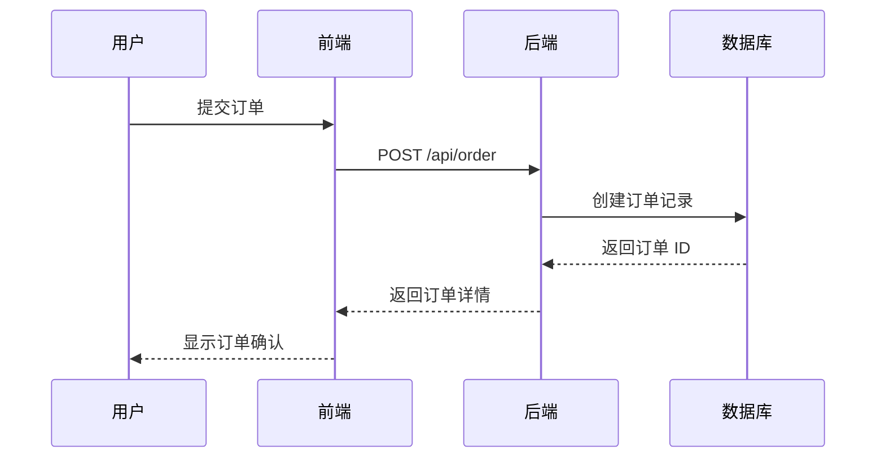
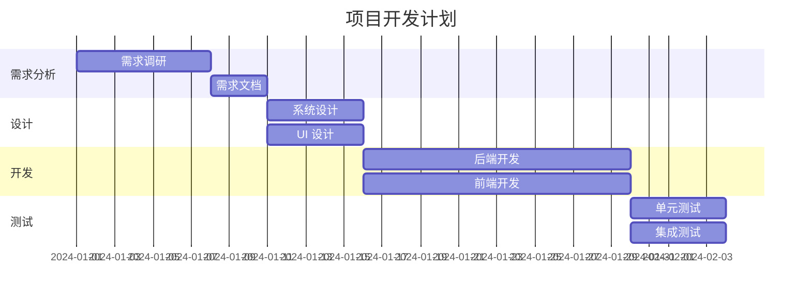
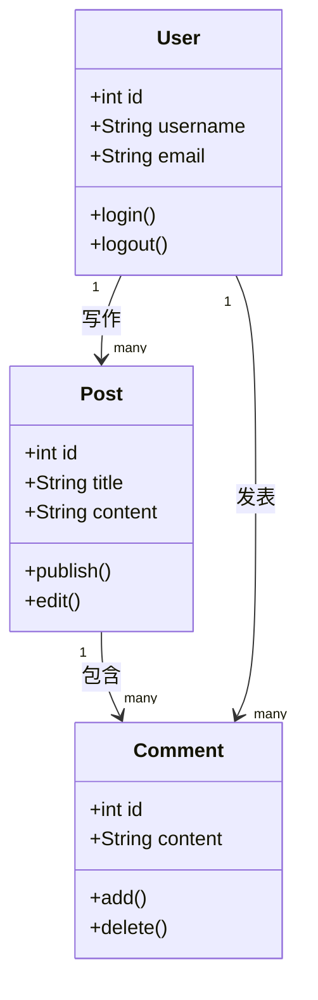
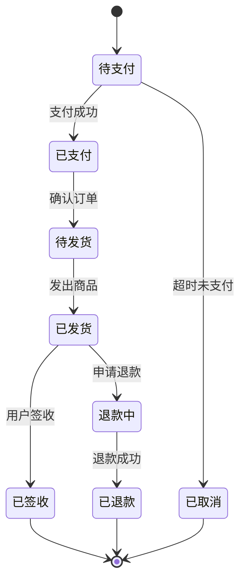
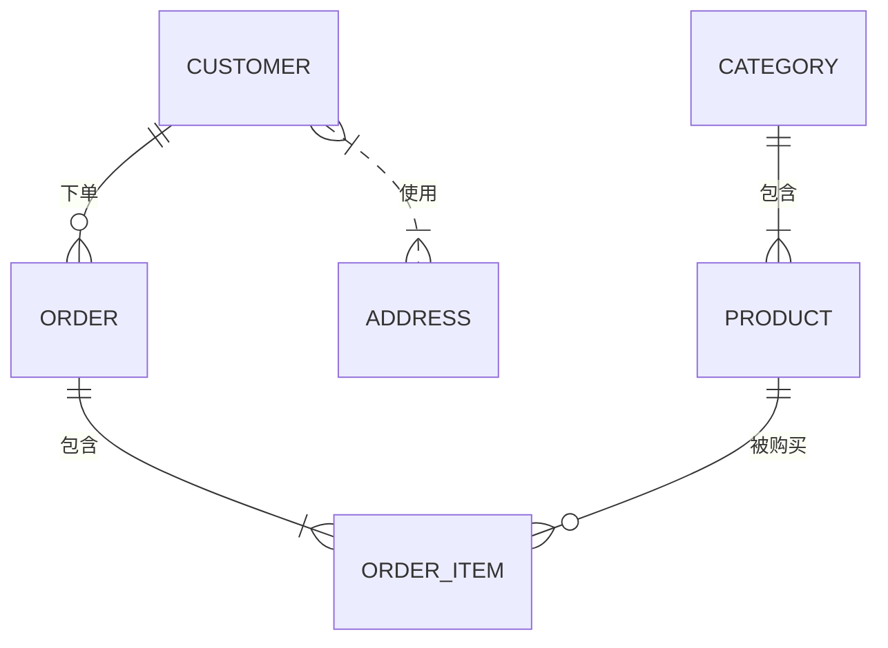
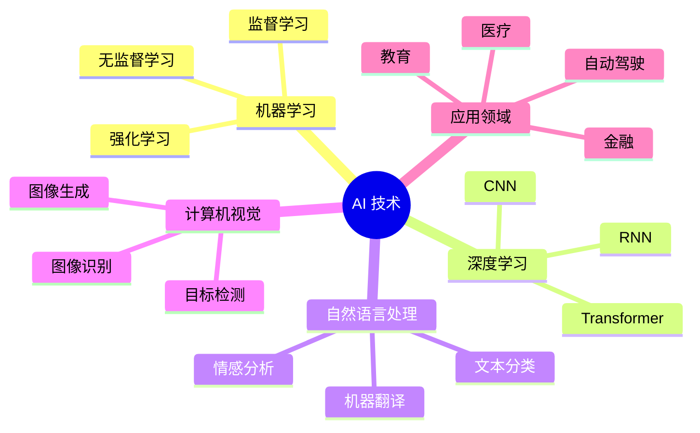
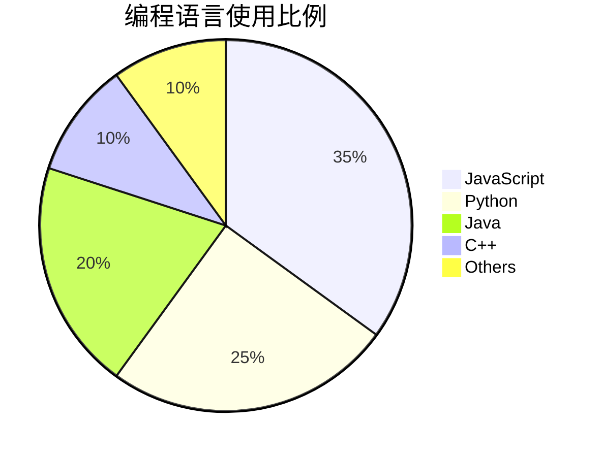

# 使用示例

## 在 OpenClaw 中的对话示例

### 示例 1：创建简单的流程图

**用户**：生成一个流程图，显示用户登录系统的流程

**小红帽**：我来为你生成一个用户登录的流程图。

生成的流程图：

### 示例 2：创建序列图

**用户**：创建一个序列图，展示电商系统中用户下单的交互

**小红帽**：好的，我来生成电商下单的序列图。

生成的序列图：

### 示例 3：创建甘特图

**用户**：帮我做一个项目甘特图，包括需求分析、设计、开发、测试阶段

**小红帽**：我来生成项目各阶段的甘特图。

生成的甘特图：

### 示例 4：创建类图

**用户**：生成一个博客系统的类图

**小红帽**：好的，我来生成博客系统的类结构图。

生成的类图：

### 示例 5：创建状态图

**用户**：生成一个订单状态的状态图

**小红帽**：我来生成订单的状态转换图。

生成的状态图：

### 示例 6：创建 ER 图

**用户**：生成一个简单的电商数据库 ER 图

**小红帽**：好的，我来生成电商数据库的关系图。

生成的 ER 图：

### 示例 7：创建思维导图

**用户**：生成一个关于 AI 技术的思维导图

**小红帽**：我来生成 AI 技术的思维导图。

生成的思维导图：

### 示例 8：创建饼图

**用户**：生成一个展示编程语言使用比例的饼图

**小红帽**：我来生成编程语言使用分布的饼图。

生成的饼图：

## 技巧提示

1. **描述要清晰**：详细描述你想要展示的内容，这样生成的图表会更准确
2. **指定类型**：如果知道要生成什么类型的图表，可以直接说"生成一个流程图/序列图/甘特图等"
3. **提供数据**：如果有具体的数据，可以一起提供，这样图表会更准确
4. **逐步细化**：可以先生成简单版本，然后根据需要添加更多细节

## 常见场景

- 系统架构设计：使用流程图和序列图
- 项目管理：使用甘特图
- 软件设计：使用类图和 ER 图
- 状态管理：使用状态图
- 数据展示：使用饼图
- 知识整理：使用思维导图
