# Mermaid Diagram Generator

Generate professional diagrams using Mermaid.js syntax - from simple flowcharts to complex system diagrams.

## Quick Start

### Basic Flowchart

Generate a simple flowchart:

```bash
node scripts/generate_diagram.js \
  --type flowchart \
  --title "Simple Flow" \
  --code "graph TD; A[Start] --> B[Process]; B --> C[End]" \
  -o diagram.png
```

### Sequence Diagram

Create a sequence diagram showing interactions:

```bash
node scripts/generate_diagram.js \
  --type sequence \
  --title "User Authentication" \
  --code "sequenceDiagram; Alice->>Bob: Hello Bob; Bob-->>Alice: Hi Alice" \
  -o sequence.png
```

### Gantt Chart

Create a project timeline:

```bash
node scripts/generate_diagram.js \
  --type gantt \
  --title "Project Timeline" \
  --code "gantt; title A Gantt Diagram; dateFormat YYYY-MM-DD; section Section; A task :a1, 2024-01-01, 30d; Another task :after a1 , 20d" \
  -o gantt.png
```

## Supported Diagram Types

### 1. Flowchart (flowchart)

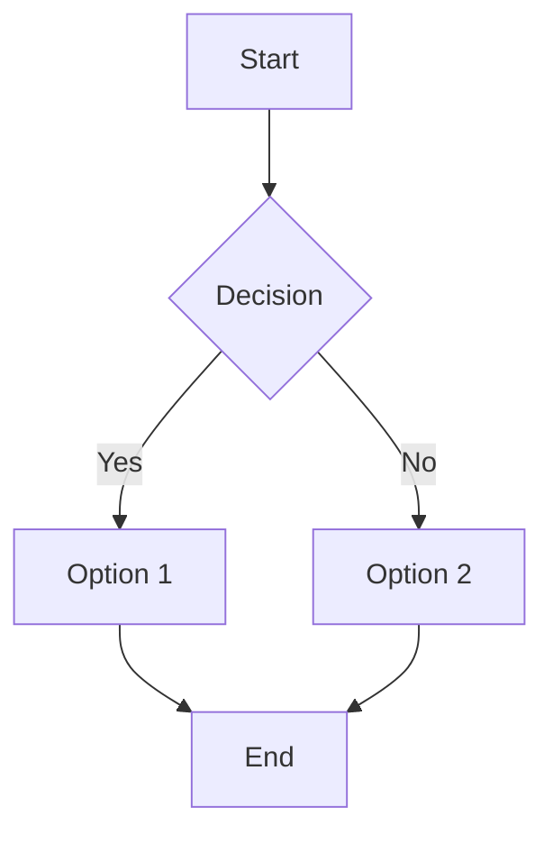

**Use cases**: Process flows, decision trees, workflow diagrams

### 2. Sequence Diagram (sequence)

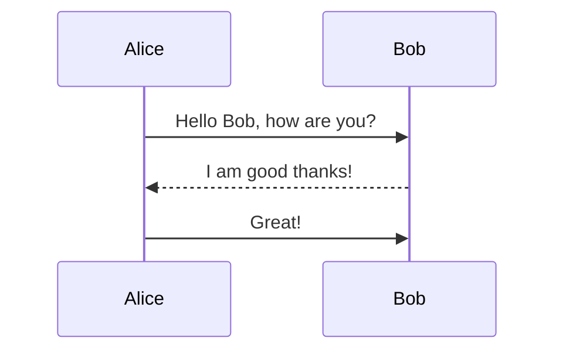

**Use cases**: API interactions, system communication, user flows

### 3. Gantt Chart (gantt)

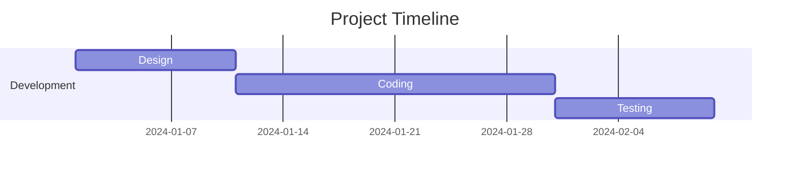

**Use cases**: Project planning, task scheduling, milestone tracking

### 4. Class Diagram (classDiagram)

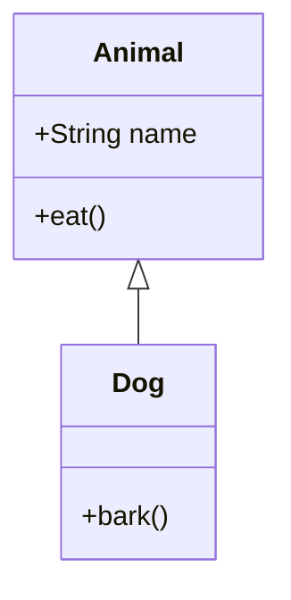

**Use cases**: Software architecture, data modeling, object-oriented design

### 5. State Diagram (stateDiagram)

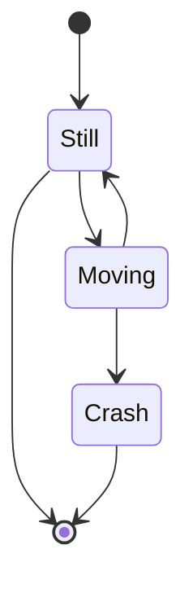

**Use cases**: State machines, workflow states, lifecycle diagrams

### 6. ER Diagram (erDiagram)

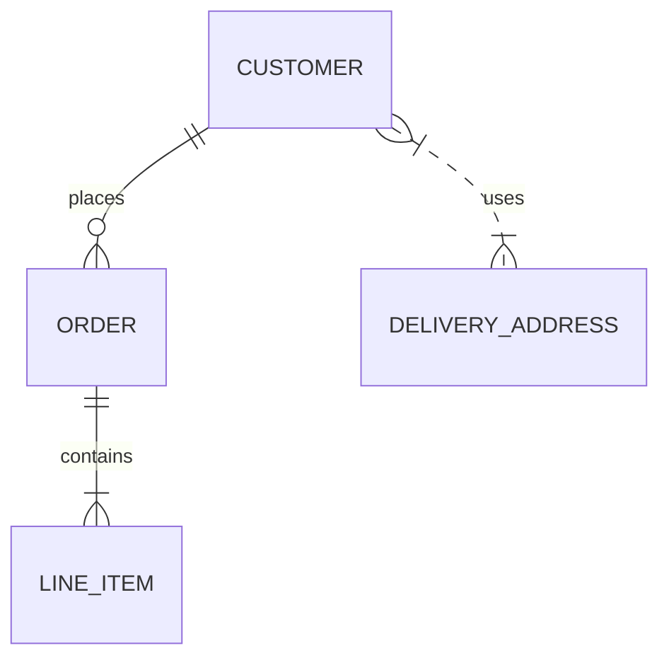

**Use cases**: Database design, data relationships, entity modeling

### 7. Pie Chart (pie)

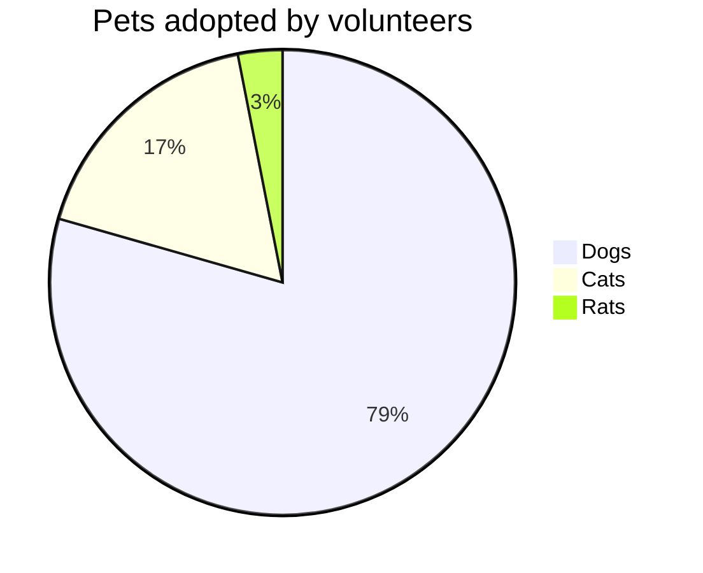

**Use cases**: Data distribution, proportions, statistics

### 8. Mindmap (mindmap)

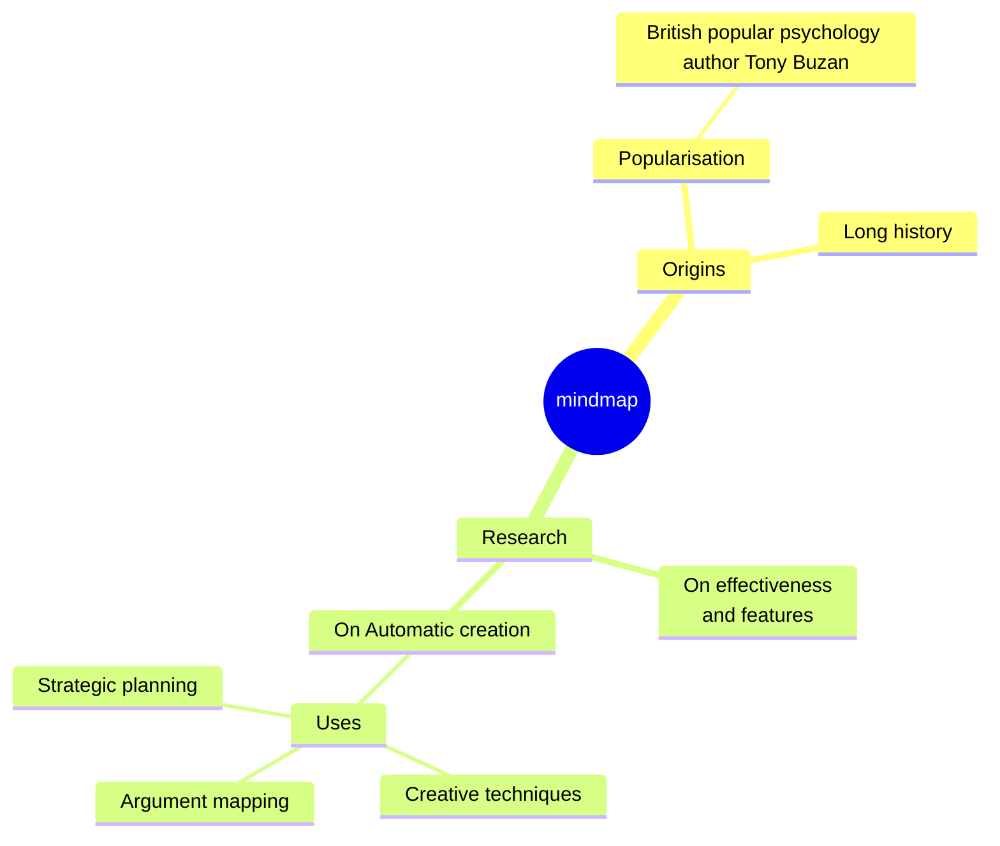

**Use cases**: Brainstorming, idea organization, knowledge mapping

## Advanced Features

### Custom Themes

Apply different visual themes:

```bash
--theme default
# Available themes: default, forest, dark, neutral

# Or use custom colors:
--theme-config '{"themeVariables": {"primaryColor": "#ffcccc"}}'
```

### Diagram Direction

Control flowchart direction:

```mermaid
# Left to right
graph LR
    A --> B

# Top to bottom (default)
graph TD
    A --> B
```

### Styling

Apply custom styles:

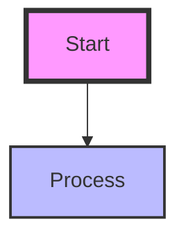

## Data Formats

### Flowchart Syntax

```
graph TD (Top Down)
graph LR (Left Right)
graph BT (Bottom Top)
graph RL (Right Left)
```

### Sequence Diagram Syntax

```
sequenceDiagram
    participant A as Name
    A->>B: Message
    B-->>A: Response
```

### Gantt Chart Syntax

```
gantt
    dateFormat YYYY-MM-DD
    section Section
    Task :id1, 2024-01-01, 30d
```

## Requirements

- Node.js 18+ (for mmdc CLI)
- mermaid-cli: Install with `npm install -g @mermaid-js/mermaid-cli`

## Installation

```bash
# Install mermaid CLI globally
npm install -g @mermaid-js/mermaid-cli

# Verify installation
mmdc --version
```

## Output

Diagrams are saved as high-quality PNG files suitable for:
- Presentations
- Documentation
- Reports
- Wiki pages

## Common Patterns

### Subgraphs in Flowcharts

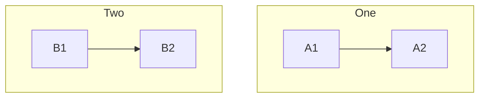

### Loops and Alt in Sequence

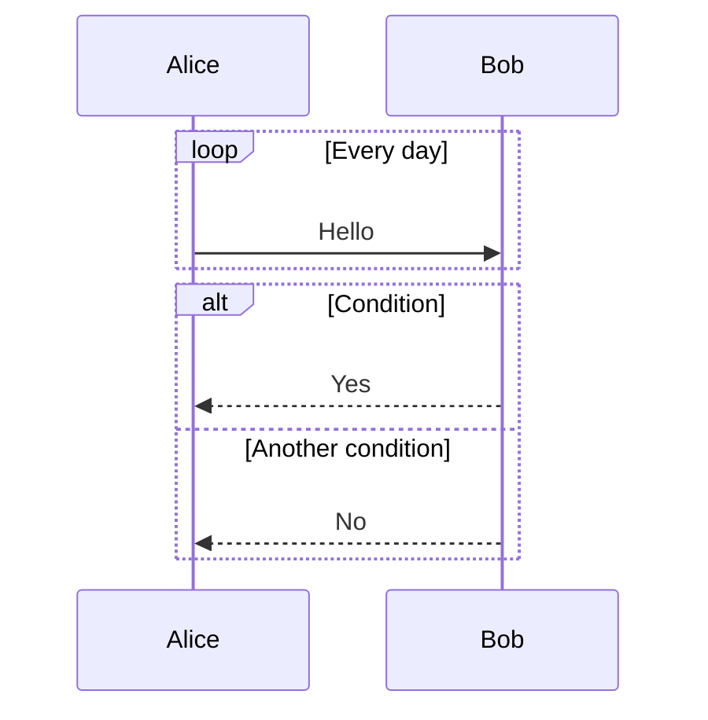

### Notes in Diagrams

```mermaid
graph LR
    A[Node A]
    Note for A[This is a note]
    A --- Note for A
```

## Tips & Tricks

1. **Keep it simple**: Start with basic structure, then add details
2. **Use comments**: `%% This is a comment` for documentation
3. **Test incrementally**: Build complex diagrams step by step
4. **Check syntax**: Use mermaid live editor for syntax validation

## Resources

- [Mermaid Official Docs](https://mermaid.js.org/intro/)
- [Mermaid Live Editor](https://mermaid.live/)
- [Mermaid Syntax Examples](https://mermaid.js.org/syntax/)
